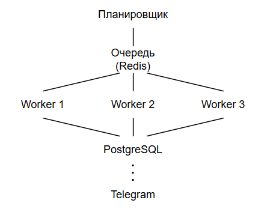

## Технологии
- python 3.10+ - основной язык
есть библиотеки для парсинга, очередей, БД и мониторинга

- playwright/selenium
в теории playwright лучше справляется с антиботом, но в текущем задании selenium решил проблему скроллинга

- postgreSQL
для хранения товаров, запросов, истории изменения позиций

- redis
для быстрого доступа к данным и кэша запросов

- celery (beat, workers)
для распределения выполнения задач, есть возможность повторного выполнения и хранение результатов

- python-telegram-bot
для отправки уведомлений

Для запуска можно использовать celery beat как планировщик задач. Задачи помещаются в Redis, откуда их забирают celery workers. Резулльтат сохраняется в PostgreSQL. Если позиция стала ниже 50, формируется событие и отправляется уведомление в Тг.

## Обеспечение устойчивости
- ограничение кол-ва запросов с одного IP (например, не более 3 запросов в 1с)
- рандомная задержка между запросами (в 1-5с)
- разумное число одновременно запущенных браузеров (5-10)
- ротация прокси с автоматической сменой IP каждые несколько запросов
- отслеживание и исключение IP с наибольшим числом ошибок
- использование разных User Agents, часовых поясов и языков
- повторные попытки (retry) с разным периодом
- использование rate limiting 
- использование логирования для анализа и трекинга сетевых проблем

## Возможные риски
- изменение верстки сайта и принципов формирования ссылок на карточки товаров
    - использовать автоматические тесты
    - мониторинг ошибок и логов
- блокировка IP-адресов
    - изменение пула прокси
    - rate limiting
- блокировка прокси
    - использование нескольких пулов и их ротация
    - использование разных провайдеров
    - использование мобильных прокси

## Примерный бюджет
- PostgreSQL: 1000-1500руб
- Redis: 700-900руб
- прокси: 3000-4000руб (около 50 IP)
- vps для воркеров: 2000-3500руб

- итого: 6700-9900руб